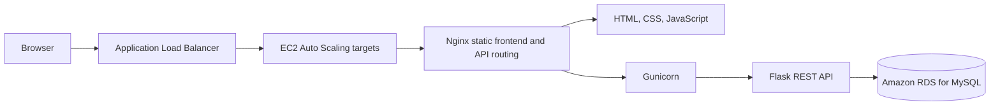

# Student Task Manager

A student task management frontend designed for deployment behind an AWS Application Load Balancer (ALB). The interface supports account access, task creation and tracking, dashboard summaries, profile details, filtering, and responsive layouts.

> **Project scope:** This repository contains the browser frontend and a small Node.js static-file server for local preview. The Flask API, database schema, AWS infrastructure definitions, and deployment automation are not included.

## Contents

- [Highlights](#highlights)
- [Architecture](#architecture)
- [Repository structure](#repository-structure)
- [Technology](#technology)
- [Requirements](#requirements)
- [Run locally](#run-locally)
- [Frontend pages](#frontend-pages)
- [API integration](#api-integration)
- [Configuration](#configuration)
- [Deployment context](#deployment-context)
- [Security notes](#security-notes)
- [Verification and limitations](#verification-and-limitations)
- [Contributing](#contributing)
- [License](#license)

## Highlights

- Dashboard with task totals and recent-task summary.
- Task list with search, status and priority filters, and sorting.
- Create, edit, complete, and delete task flows.
- Login, registration, and profile pages.
- Responsive layout, theme support, animations, and notification UI.
- Centralized API client configured for same-origin `/api` requests.

## Architecture

The deployed application is intended to use this request path:



The diagram describes the deployment context supplied for this project. This repository does not provision or configure those AWS resources. The Node.js server in this repository is for local static preview; it does not implement the Flask API or proxy `/api` requests.

## Repository structure

```text
.
├── frontend/
│   ├── assets/
│   │   ├── icons/
│   │   └── images/
│   ├── css/
│   ├── js/
│   ├── index.html
│   ├── login.html
│   ├── register.html
│   ├── dashboard.html
│   ├── tasks.html
│   └── profile.html
├── package.json
└── server.js
```

## Technology

- HTML, CSS, and browser JavaScript
- Node.js built-in `http`, `fs`, and `path` modules for the local preview server
- Deployed API integration: Flask REST API, reached through same-origin `/api`
- Deployment context: Nginx, EC2 Auto Scaling, Application Load Balancer, and Amazon RDS for MySQL

## Requirements

- Node.js 18 or a compatible current LTS release
- A reachable backend implementing the frontend API routes when exercising authenticated or data-backed features

No npm packages are required by the current preview server.

## Run locally

From the repository root:

```bash
npm start
```

Then open [http://localhost:3000](http://localhost:3000). The server serves files from `frontend/` and falls back to an `.html` file for extensionless paths.

The local preview server does not provide a backend. Data-backed screens and account actions require a compatible API at the same origin under `/api`. The deployed frontend uses the same-origin API base; no local API proxy is included here.

## Frontend pages

| Page | File | Purpose |
| --- | --- | --- |
| Landing | `frontend/index.html` | Public entry page |
| Login | `frontend/login.html` | Account sign-in interface |
| Register | `frontend/register.html` | Account registration interface |
| Dashboard | `frontend/dashboard.html` | Task summary and recent tasks |
| Tasks | `frontend/tasks.html` | Task search, filters, and task actions |
| Profile | `frontend/profile.html` | Account profile interface |

## API integration

The frontend API client uses `API_BASE_URL = "/api"`. Its request contract includes:

| Method | Route | Use |
| --- | --- | --- |
| `GET` | `/api/health` | Backend health check |
| `POST` | `/api/register` | Register with name, email, and password |
| `POST` | `/api/login` | Sign in with email and password |
| `GET` | `/api/dashboard?user_id={id}` | Load dashboard summary |
| `GET` | `/api/tasks?user_id={id}` | List a user's tasks |
| `POST` | `/api/tasks` | Create a task |
| `PUT` | `/api/tasks/{id}` | Update a task |
| `DELETE` | `/api/tasks/{id}?user_id={id}` | Delete a task |
| `PATCH` | `/api/tasks/{id}/complete` | Change task completion state |

The API implementation is not in this repository, so response schemas, backend authorization behavior, and database behavior cannot be independently verified from this source tree. Keep the existing Flask API contract stable when deploying frontend updates.

## Configuration

The frontend currently targets same-origin `/api` and has no build-time configuration or environment file. In deployment, the web server or reverse proxy must serve the frontend and route `/api` requests to the Flask application. The local Node server only serves frontend files.

## Deployment context

The project is described as deployed using an ALB in front of EC2 Auto Scaling targets, with Nginx serving the frontend and forwarding API traffic to Gunicorn/Flask, which accesses private RDS for MySQL. The AWS setup is external to this repository. Review the AWS account configuration and deployment procedures in their own secured location; do not put keys, credentials, private endpoints, or account-specific screenshots in this public repository.

## Security notes

- Never commit passwords, access tokens, private keys, cloud credentials, database connection strings, or populated `.env` files.
- Configure backend secrets on the server using the deployment's approved secret-management process; no backend environment template is included because backend source/configuration is not part of this repository.
- The frontend sends account data to the API over browser requests. Authentication, session handling, authorization, input validation, and password storage must be enforced by the backend.
- The frontend's API client contains offline mock-data support for UI development. The deployed configuration has mock mode disabled; verify this setting before deploying.
- Use HTTPS for public traffic and avoid exposing sensitive infrastructure details in screenshots or logs.

## Verification and limitations

This repository is a frontend and local static preview only. It does not include automated tests, a Flask server, database migrations, infrastructure-as-code, CloudWatch configuration, or deployment scripts. Validate the full application against the actual backend and AWS environment during deployment. No live AWS resources are changed by this repository.

## Contributing

1. Create a branch for your change.
2. Keep changes scoped to the frontend unless backend or infrastructure source is intentionally added in a separate, reviewed change.
3. Do not include secrets, production data, or unreviewed screenshots.
4. Describe and manually verify user-visible changes before opening a pull request.

## License

No license is currently declared. Add a license file and update this section before granting reuse rights.
